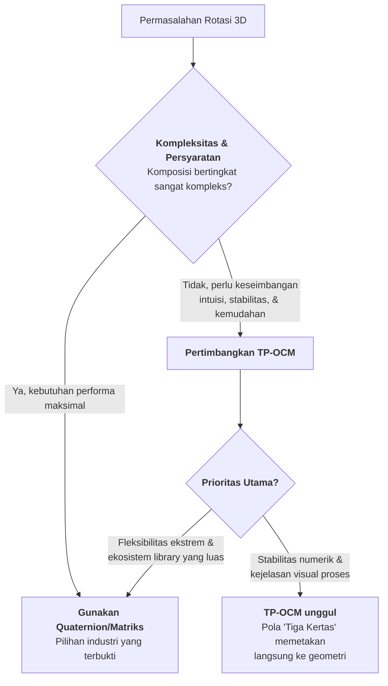
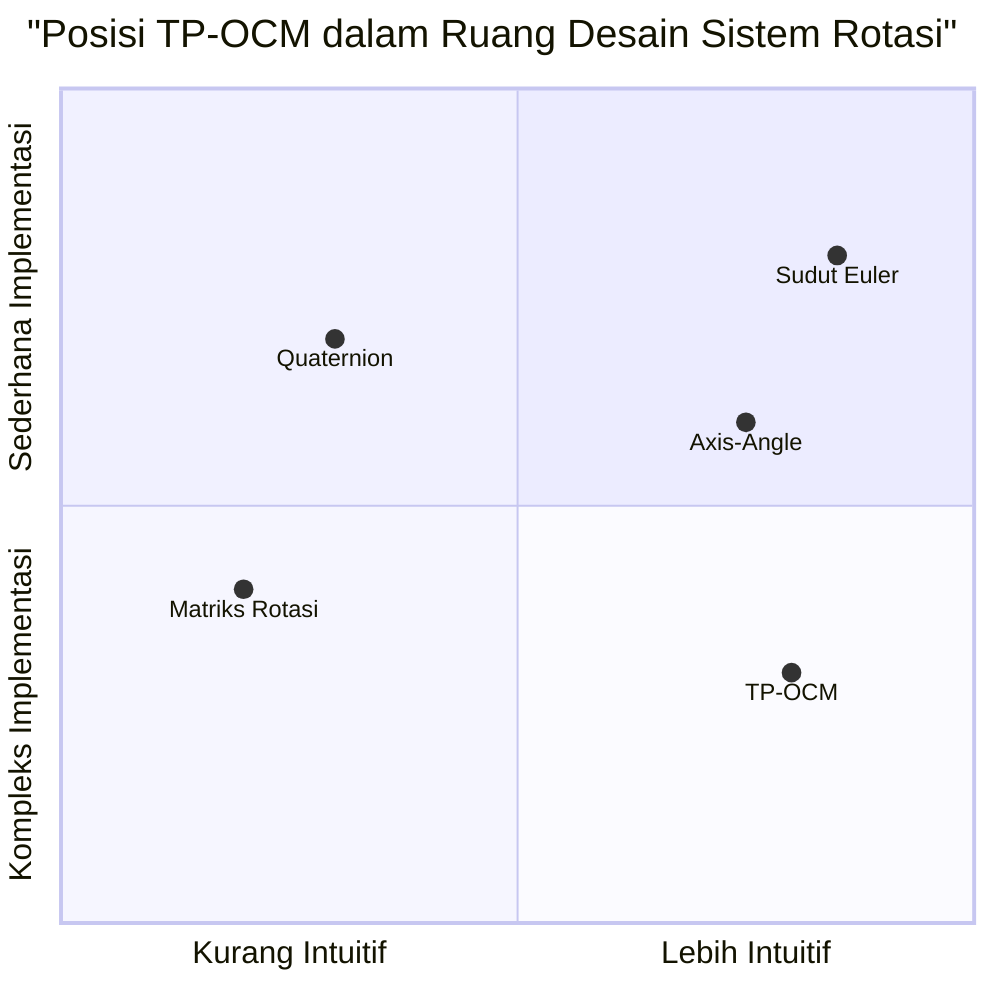

# POSITIONING_WHITEPAPER.md

## POSISI TP-OCM DALAM LANSKAP GEOMETRI KOMPUTASI
**Dokumen:** Positioning Whitepaper  
**Proyek:** Tri-Planar Orthogonal Complex Mapping (TP-OCM)  
**Versi:** 1.0  
**Tanggal:** 31 Desember 2025  
**Status:** Dokumen Posisi Strategis

---

### 1. PRAKATA: JALAN TENGAH YANG ELEGAN

Dalam ekosistem representasi ruang 3D yang telah mapan, muncul pertanyaan mendasar: **"Mengapa TP-OCM?"**

Dokumen ini tidak bermaksud mengklaim TP-OCM sebagai "revolusi" yang menggantikan segala sesuatu yang ada. Sebaliknya, kami memposisikan TP-OCM sebagai **jalan tengah yang elegan** antara kompleksitas teknis yang berlebihan dan simplifikasi yang naif—sebuah sintesis praktis yang menyeimbangkan kedalaman matematis dengan aksesibilitas intuitif.

TP-OCM adalah **solusi yang sadar konteks**, dirancang untuk domain masalah spesifik di mana kejelasan, stabilitas, dan efisiensi komputasi ringan sama-sama penting.

---

### 2. PETA LANSKAP: TEMPATKAN, JANGAN GANTIKAN

#### 2.1. **Koordinat Cartesian (x, y, z)**
*   **Posisi:** Sistem dasar, bahasa universal untuk posisi absolut.
*   **Hubungan dengan TP-OCM:** TP-OCM **membangun di atas** Cartesian. Variabel `{x₁, x₂, y}` adalah besaran Cartesian. TP-OCM menambahkan lapisan **relasi dan orientasi intrinsik** yang tidak dimiliki koordinat telanjang. Mereka bukan kompetitor, melainkan **basis dan bangunan**.

#### 2.2. **Sudut Euler & Axis-Angle**
*   **Posisi:** Representasi orientasi yang intuitif secara manusiawi, tetapi rapuh secara numerik.
*   **Hubungan dengan TP-OCM:** TP-OCM **menjawab kelemahan struktural** Euler (gimbal lock, komposisi non-linear) sambil **mempertahankan intuisi**. Setiap bidang TP-OCM memberikan "sudut Euler lokal" yang stabil (`θ₁, θ₂, θ₃`), tetapi dalam kerangka yang menjamin konsistensi global. TP-OCM adalah **Euler yang telah dikoreksi**.

#### 2.3. **Quaternion & Rotasi Matriks**
*   **Posisi:** *Workhorses* industri—stabil, efisien, dan sangat mapan untuk komposisi rotasi kompleks.
*   **Hubungan dengan TP-OCM:** TP-OCM **bukan pengganti**, melainkan **alternatif yang disederhanakan untuk kasus penggunaan tertentu**. Diagram alir keputusan berikut menjelaskan kapan memilih salah satunya:

#### 2.4. **Geometric/Clifford Algebra (GA)**
*   **Posisi:** Kerangka matematika yang dalam dan umum yang menyatukan geometri dan aljabar.
*   **Hubungan dengan TP-OCM:** Di sinilah posisi kami paling jelas. TP-OCM dapat dilihat sebagai **realisasi spesifik dan termanifestasi** dari prinsip-prinsip tertentu dalam GA. Jika GA adalah **bahasa universal teori geometri**, maka TP-OCM adalah **dialek yang dioptimalkan untuk percakapan tentang rotasi dan orientasi 3D**. TP-OCM mengambil inspirasi dari kekuatan GA, tetapi dengan sengaja **membatasi cakupannya** untuk mencapai kejelasan dan kemudahan implementasi yang lebih besar.

#### 2.5. **Dekomposisi Tri-Planar Lainnya**
*   **Posisi:** Berbagai teknik dalam grafika komputer untuk memproyeksikan tekstur atau data ke permukaan.
*   **Hubungan dengan TP-OCM:** TP-OCM berbagi **motif struktural** (tiga bidang) dengan teknik-teknik ini. Perbedaan mendasarnya adalah tujuan: dekomposisi tri-planar tradisional adalah **trik rendering untuk pemetaan tekstur**, sedangkan TP-OCM adalah **formalisme aljabar untuk representasi dan transformasi ruang itu sendiri**. Mereka adalah sepupu yang menggunakan strategi struktural serupa untuk masalah yang berbeda.

---

### 3. NILAI UNIK TP-OCM: POROS SEGITIGA KEUNGGULAN

TP-OCM tidak mencoba menjadi yang terbaik dalam segala hal. Ia bercita-cita menjadi **pilihan optimal dalam irisan spesifik dari ruang desain**, yang ditentukan oleh tiga poros:

**1. Poros Intuisi Visual (`Tiga Kertas`)**  
TP-OCM menerjemahkan operasi aljabar abstrak menjadi manipulasi objek visual yang dapat dipahami (bidang). Ini mengurangi beban kognitif untuk pembelajaran, pengajaran, dan debugging.

**2. Poros Stabilitas Konseptual (`Pola Asimetris`)**  
Dengan menetapkan variabel penghubung (`y`) dan pola dependensi yang tetap, TP-OCM menghilangkan ambiguitas dan singularitas yang muncul dalam sistem simetris atau kurang terkendali (seperti gimbal lock pada Euler).

**3. Poros Efisiensi Tertarget (`Aljabar Ringan`)**  
TP-OCM mengoptimalkan untuk kasus di mana rotasi dapat diuraikan atau diproses per bidang, memungkinkan paralelisasi alami dan penggunaan operasi aritmatika dasar yang sangat efisien (MUL/ADD), yang ideal untuk sistem embedded atau pipeline kinerja kritis.

**Irisan Ideal:** TP-OCM bersinar ketika sebuah proyek membutuhkan **lebih dari sekadar koordinat statis**, mengkhawatirkan **kerumitan dan ketidakstabilan Euler**, tetapi menemukan **quaternion terlalu abstrak** atau **GA terlalu umum** untuk kebutuhan langsungnya.

---

### 4. KLAIM YANG JELAS DAN BATASAN YANG JUJUR

**Apa yang TP-OCM Klaim (Dan Buktikan):**
*   Menyediakan **representasi orientasi 3D yang stabil dan intuitif**.
*   Menawarkan **model mental yang lebih mudah dipelajari** ("Tiga Kertas") dibandingkan quaternion untuk pemula.
*   Memungkinkan **implementasi yang efisien dan deterministik** untuk kelas masalah tertentu (rotasi berurutan yang dapat didekomposisi).
*   Berdiri sebagai **contoh konkret dan dapat dijalankan** tentang bagaimana prinsip aljabar geometris dapat dimanifestasikan dalam bentuk yang praktis.

**Apa yang TP-OCM TIDAK Klaim:**
*   Menjadi **pengganti universal** untuk quaternion atau matriks dalam semua aplikasi berkinerja tinggi.
*   Menjadi **kerangka matematika baru yang mendalam** setara dengan Geometric Algebra.
*   Memecahkan **semua masalah representasi ruang**. TP-OCM adalah alat spesialis yang sangat baik dalam niche-nya.

---

### 5. KESIMPULAN: SPESIALISASI YANG BANGGA

TP-OCM hadir bukan sebagai pemberontak yang ingin membakar lanskap yang ada, melainkan sebagai **spesialis yang ahli** yang mengisi celah yang diabaikan. Ia adalah bukti bahwa terdapat ruang untuk inovasi yang tidak selalu berupa generalisasi yang lebih luas, tetapi bisa berupa **sintesis yang lebih fokus dan dapat diakses**.

Kami mengundang komunitas untuk melihat TP-OCM tidak melalui lensa "ini vs itu", tetapi melalui lensa **"alat tepat untuk pekerjaan yang tepat"**. Untuk pendidikan, prototyping, sistem embedded dengan kendala tertentu, atau situasi di mana kejelasan visual proses rotasi adalah paramount—TP-OCM hadir sebagai **pilihan yang sah, kuat, dan elegan**.

Dengan memahami posisi ini, diskusi dapat bergeser dari pertanyaan "Apakah ini baru?" menjadi **"Kapan ini yang terbaik?"**—sebuah percakapan yang jauh lebih produktif dan tepat bagi semua insinyur, seniman, dan ilmuwan yang bekerja dengan ruang tiga dimensi.

---
**Dokumen dalam Seri TP-OCM:**
1. `CORE_MANIFESTO.md` - Landasan filosofis dan visi.
2. `POSITIONING_WHITEPAPER.md` - **(Dokumen ini)** Posisi strategis dalam lanskap.
3. `REFERENCE_SPECIFICATION.md` - Spesifikasi teknis dan implementasi kanonik.
4. `BENCHMARK_REPORT.md` - Analisis kinerja komparatif.

**Lisensi:** Creative Commons Attribution 4.0 International (CC BY 4.0)